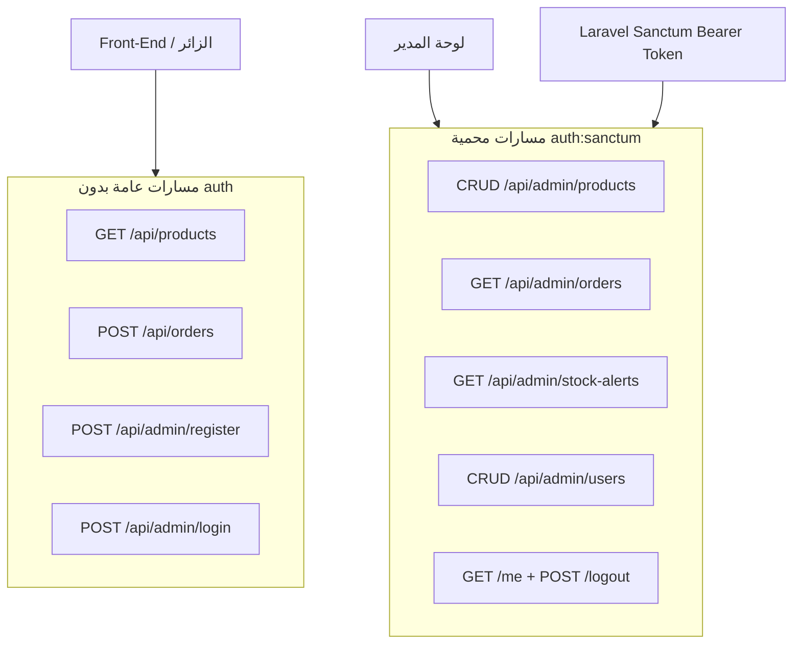
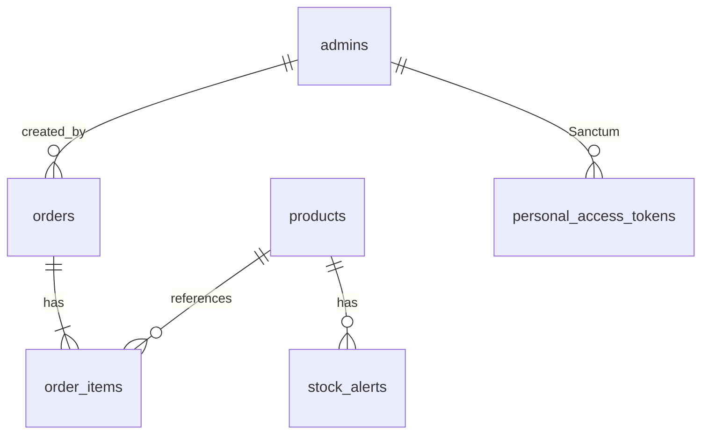
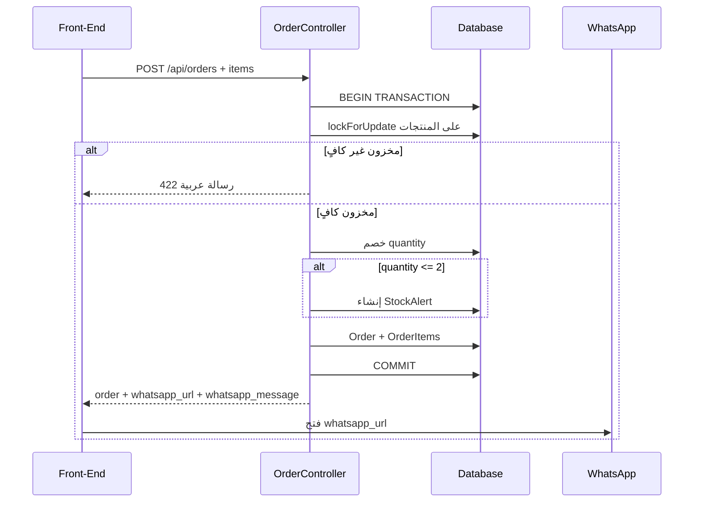

# فهم شامل لمشروع Back-End (Bashak)

## ما هو المشروع؟

**Bashak Back-End** هو خادم REST API لمتجر إلكتروني بسيط. لا توجد واجهة إدارية داخل Laravel — الواجهة الأمامية (`Front-End/`) تستهلك هذه الـ API.

**Stack:** Laravel 12 | PHP 8.2+ | Laravel Sanctum 4 | SQLite (افتراضي)

---

## البنية العامة



### هيكل الكود

| المجلد | الدور |
|--------|-------|
| `routes/api.php` | تعريف كل endpoints |
| `app/Http/Controllers/Api/` | منطق الطلبات |
| `app/Models/` | 5 نماذج Eloquent |
| `app/Http/Requests/` | التحقق من المدخلات |
| `app/Http/Resources/` | تحويل JSON للاستجابات |
| `database/migrations/` | مخطط قاعدة البيانات |
| `database/seeders/` | بيانات تجريبية |

**ما لا يوجد:** Services، Traits مخصصة، Policies، Observers، Factories، Middleware مخصص — المنطق موزّع بين Controllers و Models.

---

## قاعدة البيانات



| الجدول | الغرض | حقول مهمة |
|--------|-------|-----------|
| **admins** | مدراء المتجر | `full_name`, `email`, `password` |
| **products** | كatalog المنتجات | `product_name`, `price`, `quantity`, `image_path` |
| **orders** | طلبات الزبائن | `order_number`, `customer_name`, `whatsapp_number`, `status`, `subtotal`, `total` |
| **order_items** | بنود الطلب | snapshot: `product_name`, `unit_price`, `quantity`, `line_total` |
| **stock_alerts** | تنبيهات مخزون منخفض | `threshold=2`, `is_resolved`, `message` |

`order_items` يحفظ snapshot للمنتج (الاسم والسعر وقت الطلب) حتى لو تغيّر المنتج لاحقاً.

---

## المسارات (18 endpoint)

**البادئة:** كل مسارات `routes/api.php` تحت `/api`

### عام — للزوار

| Method | Endpoint | الوصف |
|--------|----------|-------|
| GET | `/api/products` | قائمة المنتجات |
| GET | `/api/products/{product}` | تفاصيل منتج |
| POST | `/api/orders` | إنشاء طلب |
| POST | `/api/admin/login` | تسجيل دخول المدير |
| POST | `/api/admin/register` | إنشاء admin بدون auth |

### محمي — `Authorization: Bearer {token}`

| Method | Endpoint | الوصف |
|--------|----------|-------|
| GET | `/api/admin/me` | بيانات المدير الحالي |
| POST | `/api/admin/logout` | تسجيل الخروج |
| GET/POST/PUT/DELETE | `/api/admin/products` | CRUD المنتجات |
| GET | `/api/admin/orders` | قائمة الطلبات |
| GET | `/api/admin/orders/{order}` | تفاصيل طلب |
| GET | `/api/admin/stock-alerts` | تنبيهات المخزون |
| GET/POST/PUT/DELETE | `/api/admin/users` | CRUD المدراء |

---

## تدفق إنشاء الطلب



`OrderController@store`:

1. **Transaction** مع `lockForUpdate()` لمنع race conditions على المخزون
2. التحقق من توفر المنتج والكمية
3. خصم `quantity` من كل منتج
4. إنشاء `StockAlert` إذا بقي ≤ 2 ولم يوجد تنبيه غير محلول
5. إنشاء `Order` بحالة `pending` و `created_by = null` (طلب زائر)
6. إرجاع `whatsapp_url` جاهز للفتح

### تكامل واتس أب (`Order` model)

- `whatsappMessage()` — رسالة فاتورة بالعربية
- `whatsappUrl()` — رابط `wa.me/+905316924944?text=...`
- الرقم ثابت في الكود (رقم المتجر)

---

## إدارة المنتجات

`ProductController`:

- **index/show** — عام (نفس الـ endpoint للزوار والمدير)
- **store/update/destroy** — محمي
- الصور: رفع ملف إلى `storage/products` **أو** URL خارجي
- accessor `image_url` في `Product` يحوّل `image_path` إلى URL كامل
- عند الحذف/التحديث: حذف الصورة المحلية من `public` disk

---

## المصادقة

- Guard افتراضي: `admin` (`config/auth.php`)
- Model: `Admin` مع `HasApiTokens`
- **Login:** `Admin::createToken('admin-token')` → Bearer token
- **Logout:** حذف الـ token الحالي
- **401:** رسالة عربية مخصصة في `bootstrap/app.php`

---

## Controllers

| Controller | الوظيفة |
|------------|---------|
| `AuthController` | login, me, logout |
| `AdminUserController` | CRUD مدراء — يمنع حذف الذات أو آخر مدير |
| `ProductController` | عرض عام + CRUD محمي |
| `OrderController` | إنشاء طلب (زوار) |
| `AdminOrderController` | عرض الطلبات مع items |
| `AdminStockAlertController` | قائمة تنبيهات (قراءة فقط) |

---

## Form Requests و Resources

**Requests:**

- `StoreOrderRequest` — `items[].product_id`, `quantity` 1-99
- `StoreProductRequest` / `UpdateProductRequest` — صورة file أو URL
- `StoreAdminRequest` / `UpdateAdminRequest` — password min:8 + confirmed

**Resources:** `ProductResource`, `OrderResource`, `OrderItemResource`, `AdminResource`, `StockAlertResource`

---

## Seeders والتشغيل

```bash
composer install && cp .env.example .env && php artisan key:generate
php artisan migrate --seed && php artisan storage:link && php artisan serve
```

**حساب افتراضي:** `admin@store.com` / `password123`

**5 منتجات تجريبية** بالعربية في `ProductSeeder`

---

## فجوات وملاحظات

1. **`POST /api/admin/register` مفتوح** — أي شخص يمكنه إنشاء admin (مراجعة أمنية للإنتاج)
2. **Stock alerts:** تُنشأ تلقائياً لكن لا endpoint لحلها (`is_resolved` لا يُحدَّث)
3. **لا tests حقيقية** — فقط ExampleTest افتراضي

---

## التوثيق الإضافي

- `README.md` — دليل التثبيت والـ API
- `api doxc/api.md` — توثيق API بالعربية (تفصيلي)

---

## الخلاصة

المشروع **API-first store backend** بثلاثة محاور:

1. **عرض عام** — منتجات للزوار
2. **طلبات** — سلة → transaction → مخزون → واتس أب
3. **إدارة** — CRUD منتجات/مدراء + مراقبة طلبات وتنبيهات مخزون

البنية بسيطة ومناسبة لمشروع صغير: Controllers + Models + Requests/Resources بدون طبقات إضافية.
