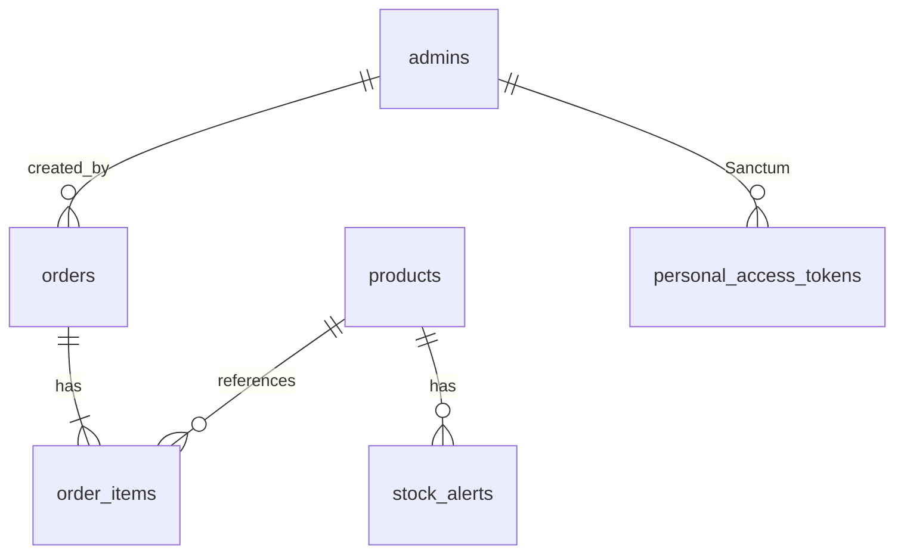
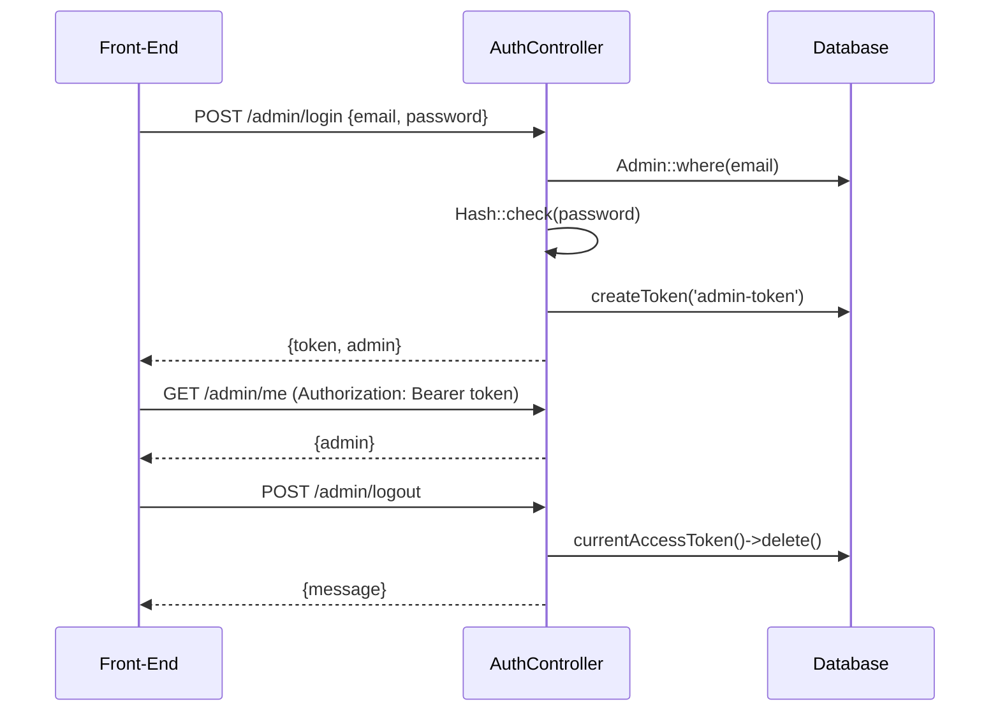
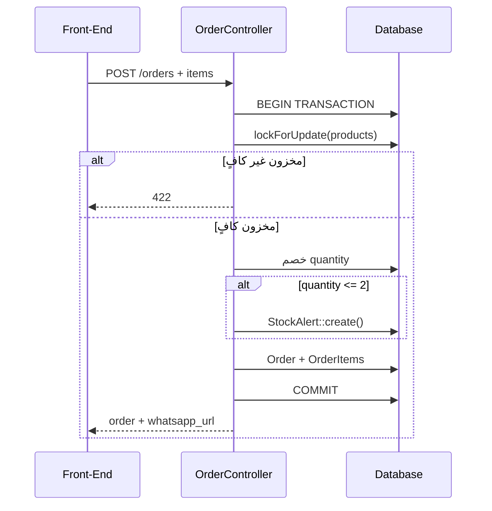

# Bashak Back-End — Core (النواة الأساسية)

مرجع داخلي للهيكلية، الملفات المهمة، والدوال الأساسية في مشروع **Bashak Back-End**.

> **للـ API التفصيلي:** راجع [`api.md`](./api.md)  
> **للمح overview معماري:** راجع [`../ARCHITECTURE.md`](../ARCHITECTURE.md)

---

## نظرة عامة

| البند | القيمة |
|-------|--------|
| **النوع** | REST API لمتجر إلكتروني (API-first) |
| **Framework** | Laravel 12 |
| **PHP** | ^8.2 |
| **المصادقة** | Laravel Sanctum 4 (Bearer Token) |
| **قاعدة البيانات** | SQLite (افتراضي) |
| **الواجهة** | `Front-End/` تستهلك هذه الـ API — لا توجد UI داخل Laravel |

### المحاور الثلاثة للمشروع

1. **عرض عام** — المنتجات للزوار بدون تسجيل دخول
2. **الطلبات** — سلة → transaction → خصم مخزون → رابط واتس أب
3. **الإدارة** — CRUD منتجات/مدراء + مراقبة طلبات وتنبيهات مخزون

---

## هيكل المجلدات

```
Back-End/
├── app/
│   ├── Http/
│   │   ├── Controllers/
│   │   │   ├── Controller.php              # Controller الأساسي (فارغ)
│   │   │   └── Api/                        # ← كل منطق الـ API هنا
│   │   ├── Requests/                       # التحقق من المدخلات (FormRequest)
│   │   │   ├── Admin/
│   │   │   ├── Auth/
│   │   │   ├── Order/
│   │   │   └── Product/
│   │   └── Resources/                      # تحويل Models → JSON
│   ├── Models/                             # 5 نماذج Eloquent
│   └── Providers/
│       └── AppServiceProvider.php          # (فارغ حالياً)
├── bootstrap/
│   └── app.php                             # تهيئة التطبيق + معالجة 401
├── config/
│   ├── auth.php                            # Guard: admin
│   └── sanctum.php                         # إعدادات Sanctum
├── database/
│   ├── migrations/                         # مخطط قاعدة البيانات
│   └── seeders/                            # بيانات تجريبية
├── routes/
│   └── api.php                             # ← نقطة الدخول لكل endpoints
├── public/
│   └── index.php                           # Front controller
└── storage/app/public/products/            # صور المنتجات المرفوعة
```

### ما **لا** يوجد في المشروع

لا توجد طبقات إضافية مثل: **Services**، **Repositories**، **Policies**، **Observers**، **Middleware مخصص**، **Factories**، **Events/Listeners**. المنطق موزّع مباشرة بين **Controllers** و **Models**.

---

## نقطة الدخول والتهيئة

### `bootstrap/app.php`

```php
Application::configure(...)
    ->withRouting(
        web: routes/web.php,
        api: routes/api.php,      // كل المسارات تحت /api
        health: '/up',             // فحص صحة الخادم
    )
    ->withMiddleware(...)          // redirectGuestsTo → null (لا redirect للـ API)
    ->withExceptions(...)          // 401 مخصص بالعربية لمسارات api/*
```

**الوظيفة:** تسجيل المسارات، وتخصيص رسالة `401` للـ API:

```json
{ "message": "غير مصرح بالوصول. يرجى تسجيل الدخول." }
```

### `config/auth.php`

| الإعداد | القيمة |
|---------|--------|
| Guard الافتراضي | `admin` |
| Provider | `admins` → Model `App\Models\Admin` |
| Driver | `session` (Sanctum يستخدم tokens منفصلة) |

---

## المسارات — `routes/api.php`

```mermaid
flowchart LR
    subgraph public [عام — بدون auth]
        P1[GET /products]
        P2[GET /products/{id}]
        P3[POST /orders]
        P4[POST /admin/login]
        P5[POST /admin/register]
    end

    subgraph protected [محمي — auth:sanctum]
        A1[GET /admin/me]
        A2[POST /admin/logout]
        A3[CRUD /admin/products]
        A4[GET /admin/orders]
        A5[GET /admin/stock-alerts]
        A6[CRUD /admin/users]
    end
```

| Method | Endpoint | Controller@method | Auth |
|--------|----------|-------------------|------|
| GET | `/api/products` | `ProductController@index` | — |
| GET | `/api/products/{product}` | `ProductController@show` | — |
| POST | `/api/orders` | `OrderController@store` | — |
| POST | `/api/admin/login` | `AuthController@login` | — |
| POST | `/api/admin/register` | `AdminUserController@store` | — |
| GET | `/api/admin/me` | `AuthController@me` | Bearer |
| POST | `/api/admin/logout` | `AuthController@logout` | Bearer |
| GET/POST/PUT/DELETE | `/api/admin/products` | `ProductController` | Bearer |
| GET | `/api/admin/orders` | `AdminOrderController@index` | Bearer |
| GET | `/api/admin/orders/{order}` | `AdminOrderController@show` | Bearer |
| GET | `/api/admin/stock-alerts` | `AdminStockAlertController@index` | Bearer |
| GET/POST/PUT/DELETE | `/api/admin/users` | `AdminUserController` | Bearer |

---

## Models — النماذج

### العلاقات بين الجداول



---

### `App\Models\Admin`

**الملف:** `app/Models/Admin.php`  
**الجدول:** `admins`  
**Traits:** `HasApiTokens`, `Notifiable`

| الحقل | النوع | ملاحظات |
|-------|-------|---------|
| `full_name` | string | |
| `email` | string | unique |
| `password` | string | hashed تلقائياً |

**العلاقات:**
- `orders()` → `HasMany(Order::class, 'created_by')`

**الدوال:** لا توجد دوال مخصصة — Sanctum يوفر `createToken()`, `tokens()`, إلخ.

---

### `App\Models\Product`

**الملف:** `app/Models/Product.php`  
**الجدول:** `products`

| الحقل | النوع | ملاحظات |
|-------|-------|---------|
| `product_name` | string | |
| `description` | text | |
| `price` | decimal(10,2) | |
| `quantity` | integer | المخزون |
| `image_path` | string | مسار محلي أو URL خارجي |

**Accessor مهم:**

| الدالة | الوصف |
|--------|-------|
| `getImageUrlAttribute()` | يحوّل `image_path` إلى URL كامل. إذا كان يبدأ بـ `http(s)://` يُرجع كما هو، وإلا `Storage::disk('public')->url()` |

---

### `App\Models\Order`

**الملف:** `app/Models/Order.php`  
**الجدول:** `orders`

| الحقل | النوع | ملاحظات |
|-------|-------|---------|
| `order_number` | string | unique — مثل `ORD-20260611120000-AB12` |
| `customer_name` | string | |
| `whatsapp_number` | string | رقم العميل |
| `notes` | text | nullable |
| `subtotal` / `total` | decimal(10,2) | |
| `status` | string | افتراضي: `pending` |
| `created_by` | FK admins | nullable — `null` لطلبات الزوار |

**العلاقات:**
- `items()` → `HasMany(OrderItem::class)`

**الدوال الأساسية:**

| الدالة | الوصف |
|--------|-------|
| `whatsappMessage()` | يبني رسالة فاتورة بالعربية (رقم الطلب، العميل، البنود، الإجمالي) |
| `whatsappUrl()` | رابط `https://wa.me/{phone}?text=...` جاهز للفتح |
| `whatsappRecipientNumber()` | يُرجع `+905316924944` (رقم المتجر — ثابت في الكود) |
| `formatMoney()` *(private)* | تنسيق المبالغ بـ 2 خانات عشرية |

---

### `App\Models\OrderItem`

**الملف:** `app/Models/OrderItem.php`  
**الجدول:** `order_items`

> **Snapshot:** يحفظ `product_name` و `unit_price` وقت الطلب حتى لو تغيّر المنتج لاحقاً.

| الحقل | الوصف |
|-------|-------|
| `order_id` | FK → orders |
| `product_id` | FK → products |
| `product_name` | snapshot |
| `unit_price` | snapshot |
| `quantity` | |
| `line_total` | unit_price × quantity |

**العلاقات:** `order()`, `product()` → `BelongsTo`

---

### `App\Models\StockAlert`

**الملف:** `app/Models/StockAlert.php`  
**الجدول:** `stock_alerts`

| الحقل | الوصف |
|-------|-------|
| `product_id` | FK → products |
| `product_name` | snapshot |
| `remaining_quantity` | الكمية المتبقية وقت التنبيه |
| `threshold` | افتراضي: `2` |
| `message` | رسالة عربية |
| `is_resolved` | boolean — **لا يُحدَّث حالياً من أي endpoint** |

---

## Controllers — المتحكمات

### `AuthController`

**الملف:** `app/Http/Controllers/Api/AuthController.php`

| Method | الدالة | الوصف |
|--------|--------|-------|
| POST | `login(LoginRequest)` | التحقق من email/password → `createToken('admin-token')` → Bearer token |
| GET | `me(Request)` | بيانات المدير الحالي عبر `$request->user()` |
| POST | `logout(Request)` | `$request->user()->currentAccessToken()->delete()` |

---

### `AdminUserController`

**الملف:** `app/Http/Controllers/Api/AdminUserController.php`

| Method | الدالة | الوصف |
|--------|--------|-------|
| GET | `index()` | قائمة كل المدراء |
| POST | `store(StoreAdminRequest)` | إنشاء مدير (يُستخدم أيضاً في `/admin/register`) |
| PUT | `update(UpdateAdminRequest, Admin)` | تحديث جزئي — عند تغيير password تُحذف كل tokens |
| DELETE | `destroy(Request, Admin)` | يمنع: حذف الذات + حذف آخر مدير |

**قواعد الحماية في `destroy`:**
```php
if ($request->user()->id === $admin->id) → 422
if (Admin::count() <= 1) → 422
```

---

### `ProductController`

**الملف:** `app/Http/Controllers/Api/ProductController.php`

| Method | الدالة | Auth | الوصف |
|--------|--------|------|-------|
| GET | `index()` | عام/محمي | `Product::latest()->get()` |
| GET | `show(Product)` | عام | Route Model Binding |
| POST | `store(StoreProductRequest)` | محمي | رفع صورة أو URL |
| PUT | `update(UpdateProductRequest, Product)` | محمي | تحديث + استبدال الصورة |
| DELETE | `destroy(Product)` | محمي | حذف المنتج + الصورة المحلية |

**دوال مساعدة:**

| الدالة | الوصف |
|--------|-------|
| `deleteLocalImageIfNeeded(?string $imagePath)` | يحذف من `public` disk فقط إذا لم تكن URL خارجية |

**منطق الصور:**
- رفع ملف → `$request->file('image')->store('products', 'public')`
- أو URL خارجي → يُحفظ مباشرة في `image_path`

---

### `OrderController` ⭐ (الأهم)

**الملف:** `app/Http/Controllers/Api/OrderController.php`

| Method | الدالة | الوصف |
|--------|--------|-------|
| POST | `store(StoreOrderRequest)` | إنشاء طلب مع transaction كامل |

**تدفق `store()` بالتفصيل:**

```
1. DB::transaction()
2. Product::lockForUpdate()        ← منع race condition على المخزون
3. لكل item:
   ├── التحقق من وجود المنتج
   ├── التحقق: quantity <= product.quantity
   ├── خصم quantity من المنتج
   ├── إذا remaining <= 2 ولا يوجد alert غير محلول → StockAlert::create()
   └── تجهيز بيانات OrderItem (snapshot)
4. Order::create() — status: pending, created_by: null
5. order->items()->createMany()
6. COMMIT
7. إرجاع OrderResource + whatsapp_url + whatsapp_message
```

**دوال مساعدة:**

| الدالة | الوصف |
|--------|-------|
| `generateOrderNumber()` | `ORD-{YmdHis}-{RANDOM4}` — يتحقق من عدم التكرار |

**أخطاء محتملة (422):**
- منتج غير موجود: `"أحد المنتجات المحددة لم يعد متاحاً."`
- مخزون غير كافٍ: `"الكمية المطلوبة لبعض المنتجات أكبر من المخزون المتاح."`

---

### `AdminOrderController`

**الملف:** `app/Http/Controllers/Api/AdminOrderController.php`

| Method | الدالة | الوصف |
|--------|--------|-------|
| GET | `index()` | `Order::with('items')->latest()->get()` |
| GET | `show(Order)` | `$order->load('items')` |

> قراءة فقط — لا يوجد update/delete للطلبات.

---

### `AdminStockAlertController`

**الملف:** `app/Http/Controllers/Api/AdminStockAlertController.php`

| Method | الدالة | الوصف |
|--------|--------|-------|
| GET | `index()` | `StockAlert::latest()->get()` |

> قراءة فقط — لا endpoint لحل التنبيهات (`is_resolved`).

---

## Form Requests — التحقق من المدخلات

| الملف | يُستخدم في | القواعد الأساسية |
|-------|-----------|------------------|
| `Auth/LoginRequest` | login | email, password |
| `Admin/StoreAdminRequest` | register, create user | full_name, email unique, password min:8 confirmed |
| `Admin/UpdateAdminRequest` | update user | حقول اختيارية + password confirmed |
| `Product/StoreProductRequest` | create product | image: file (jpeg/png/gif/webp max 2MB) **أو** URL |
| `Product/UpdateProductRequest` | update product | نفس Store + الحقول optional |
| `Order/StoreOrderRequest` | create order | customer_name, whatsapp_number, items[].product_id exists, quantity 1-99 |

---

## API Resources — تنسيق JSON

| Resource | الحقول المُرجَعة |
|----------|-----------------|
| `AdminResource` | id, full_name, email, created_at |
| `ProductResource` | id, product_name, description, price, quantity, **image_url**, timestamps |
| `OrderResource` | id, order_number, customer, whatsapp, notes, status, subtotal, total, items, whatsapp_message, whatsapp_url |
| `OrderItemResource` | id, product_id, product_name, unit_price, quantity, line_total |
| `StockAlertResource` | id, product_id, product_name, remaining_quantity, threshold, message, is_resolved |

> `OrderResource` يُرجع `whatsapp_*` فقط عندما تكون `items` محمّلة (`whenLoaded`).

---

## قاعدة البيانات — Migrations

| Migration | الجدول | ملاحظات |
|-----------|--------|---------|
| `0001_01_01_000000_create_admins_table` | admins | |
| `0001_01_01_000003_create_products_table` | products | |
| `2026_06_11_000002_add_quantity_to_products_table` | products | إضافة quantity |
| `2026_06_11_000004_drop_created_by_from_products_table` | products | إزالة created_by |
| `2026_06_11_000000_create_orders_table` | orders | |
| `2026_06_11_000001_create_order_items_table` | order_items | |
| `2026_06_11_000003_create_stock_alerts_table` | stock_alerts | |
| `2026_06_10_185012_create_personal_access_tokens_table` | personal_access_tokens | Sanctum |

---

## Seeders — البيانات التجريبية

**الملف:** `database/seeders/DatabaseSeeder.php`

```php
$this->call([AdminSeeder::class, ProductSeeder::class]);
```

| Seeder | المحتوى |
|--------|---------|
| `AdminSeeder` | `admin@store.com` / `password123` |
| `ProductSeeder` | 5 منتجات تجريبية بالعربية |

---

## المصادقة — Sanctum Flow



**ملاحظات:**
- Guard: `admin` — Model: `Admin extends Authenticatable`
- تغيير password → `$admin->tokens()->delete()` (إبطال كل الجلسات)
- `POST /admin/register` **مفتوح** — أي شخص يمكنه إنشاء admin

---

## تدفق إنشاء الطلب (Core Business Logic)



---

## التشغيل السريع

```bash
composer install
cp .env.example .env
php artisan key:generate
php artisan migrate --seed
php artisan storage:link
php artisan serve
```

| الأمر | الوظيفة |
|-------|---------|
| `composer dev` | تشغيل server + queue + logs + vite معاً |
| `composer test` | PHPUnit tests |
| `GET /up` | فحص صحة التطبيق |

---

## ملاحظات مهمة للمطور

| # | الموضوع | التفاصيل |
|---|---------|----------|
| 1 | **لا Services layer** | أضف Service class إذا كبر المنطق (مثلاً OrderService) |
| 2 | **Register مفتوح** | `POST /admin/register` بدون auth — راجع أمنياً للإنتاج |
| 3 | **Stock alerts** | تُنشأ تلقائياً لكن لا endpoint لحلها |
| 4 | **رقم واتس أب** | ثابت في `Order::WHATSAPP_RECIPIENT_NUMBER` |
| 5 | **الصور** | تحتاج `php artisan storage:link` |
| 6 | **Tests** | فقط ExampleTest افتراضي — لا coverage حقيقي |
| 7 | **CORS** | اضبطه إذا Front-End على domain مختلف |

---

## خريطة سريعة: أين أجد ماذا؟

| أريد... | اذهب إلى |
|---------|----------|
| إضافة endpoint جديد | `routes/api.php` + Controller جديد في `Api/` |
| تغيير قواعد التحقق | `app/Http/Requests/` |
| تغيير شكل JSON | `app/Http/Resources/` |
| منطق الطلب والمخزون | `OrderController@store` |
| رسالة/رابط واتس أب | `Order` model → `whatsappMessage()`, `whatsappUrl()` |
| صور المنتجات | `ProductController` + accessor `image_url` |
| المصادقة | `AuthController` + `config/auth.php` |
| مخطط DB | `database/migrations/` |
| بيانات تجريبية | `database/seeders/` |

---

## الخلاصة

المشروع يتبع **بنية Laravel بسيطة ومسطّحة**:

```
Request → FormRequest (validation) → Controller (logic) → Model (data) → Resource (JSON)
```

**الملفات الأكثر أهمية:**
1. `routes/api.php` — تعريف كل المسارات
2. `OrderController.php` — قلب منطق الأعمال (مخزون + طلبات)
3. `ProductController.php` — إدارة الكatalog
4. `Order.php` — تكامل واتس أب
5. `AuthController.php` — المصادقة
6. `bootstrap/app.php` — تهيئة + 401 مخصص
